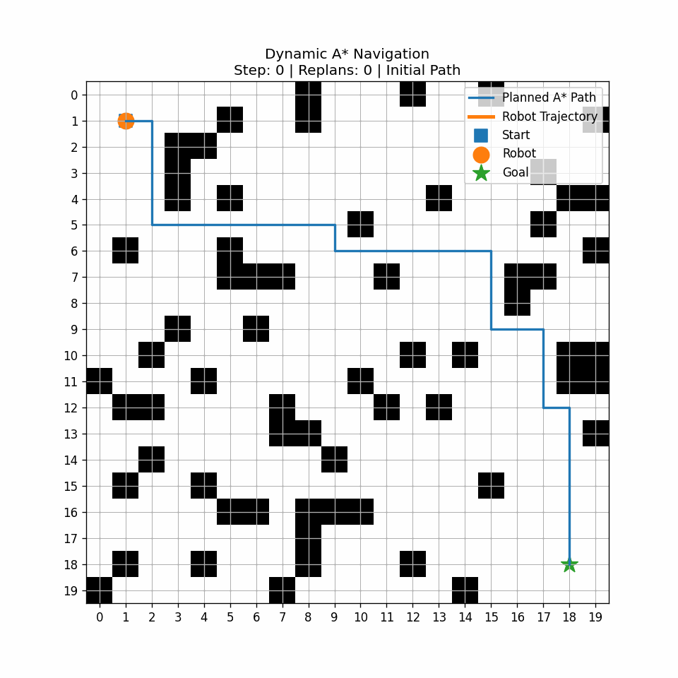
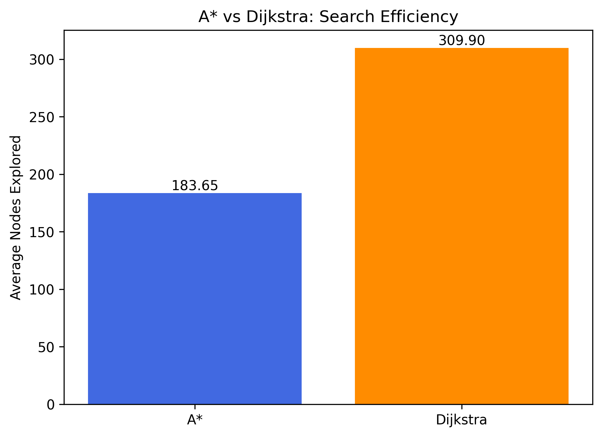
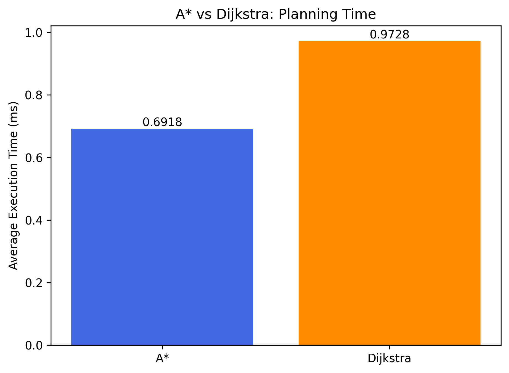
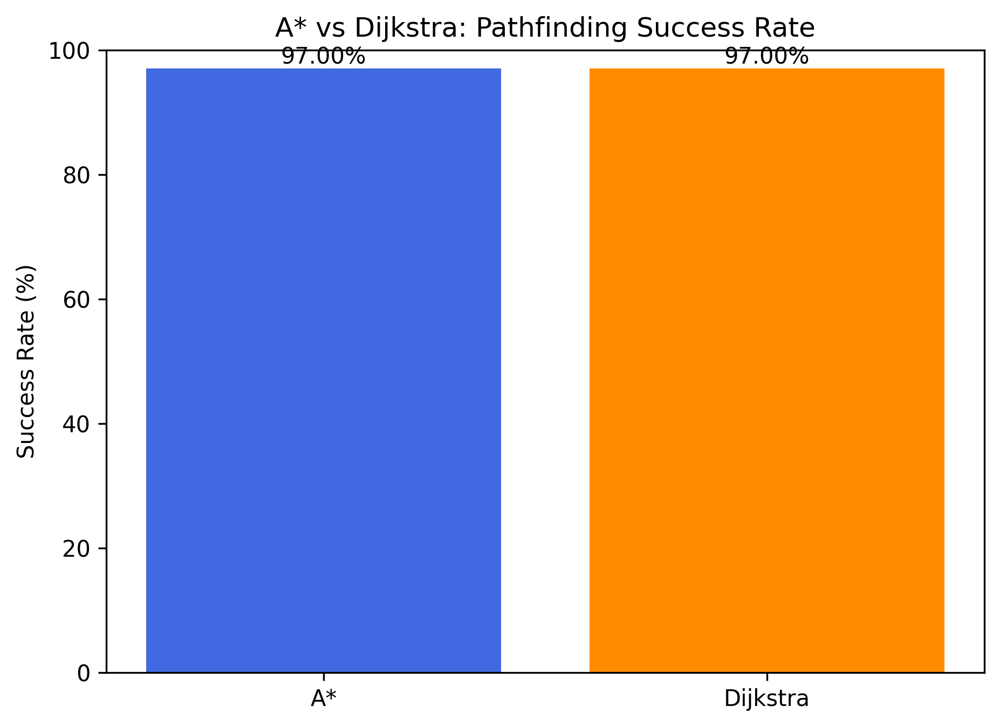
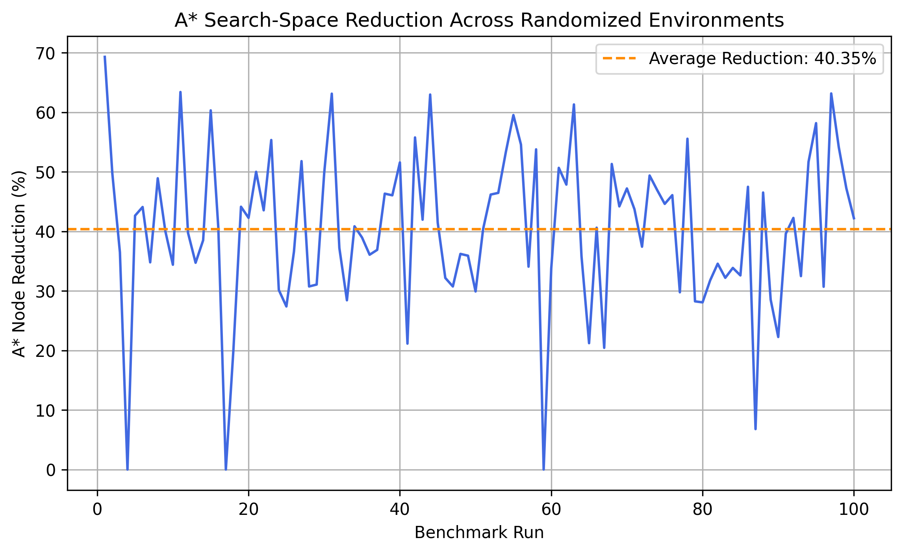

# Robo-Path

**Robo-Path** is a Python-based autonomous robot navigation simulator that implements **A\*** and **Dijkstra's algorithm** across randomized grid environments.

The project compares heuristic-guided and uninformed shortest-path search, benchmarks both algorithms across multiple environments, and extends static path planning with **dynamic obstacle generation, A\* replanning, animated robot movement, and GIF-based visualization**.

---

## Demo

<p align="center">
  
</p>

The animation shows a robot navigating toward a goal while new obstacles appear during movement. When an obstacle interferes with the current route, A\* recalculates a new path from the robot's current position.

---

## Features

- Grid-based robot navigation environment
- Randomized obstacle generation
- A\* shortest-path planning
- Dijkstra shortest-path planning
- Manhattan-distance heuristic
- Dynamic obstacles during robot movement
- Path replanning from the robot's current position
- Performance benchmarking across randomized environments
- Comparison of nodes explored and execution time
- Pathfinding success-rate analysis
- Optimal-path validation between A\* and Dijkstra
- Real-time Matplotlib navigation visualization
- Automated benchmark visualizations
- GIF export of dynamic navigation simulations

---

## Algorithms

### A\*

A\* evaluates each candidate node using:

```text
f(n) = g(n) + h(n)
```

where:

- `g(n)` is the cost from the start position to the current node
- `h(n)` is the estimated distance from the current node to the goal
- `f(n)` is the total estimated path cost

Robo-Path uses the **Manhattan distance** as the heuristic:

```text
h(n) = |current_row - goal_row| + |current_col - goal_col|
```

Because movement is currently restricted to four directions:

```text
Up
Down
Left
Right
```

the Manhattan-distance heuristic is appropriate for the grid environment.

---

### Dijkstra's Algorithm

Dijkstra's algorithm explores nodes using only the accumulated path cost:

```text
priority = g(n)
```

Unlike A\*, Dijkstra does not use information about the goal's location to guide its search.

This makes Dijkstra useful as a baseline for measuring how much the A\* heuristic reduces unnecessary exploration.

---

## A\* vs Dijkstra

Both algorithms operate on the **same randomized environment during each benchmark run**.

This ensures that differences in performance are caused by the algorithms rather than differences between maps.

The main comparison metrics are:

- Pathfinding success rate
- Path length
- Nodes explored
- Execution time
- A\* node-reduction percentage
- Optimal-path agreement

---

## Benchmark Experiment

A\* and Dijkstra were evaluated across **100 randomized 20×20 grid environments**.

Each environment used approximately **20% obstacle density**, while the start and goal positions remained available.

Some randomly generated maps may contain no valid path. These cases are intentionally retained as part of the benchmark.

### Results

| Metric | A\* | Dijkstra |
|---|---:|---:|
| Success Rate | 97.00% | 97.00% |
| Average Nodes Explored | 183.65 | 309.90 |
| Average Execution Time | 0.6918 ms | 0.9728 ms |
| Average Successful Path Length | 34.37 | 34.37 |
| Optimal-Path Mismatches | 0 | 0 |

A\* reduced the average number of explored nodes by **40.35%** compared with Dijkstra.

A\* also reduced average planning time from **0.9728 ms** to **0.6918 ms**, which corresponds to approximately a **28.9% reduction in average execution time** for this benchmark.

Most importantly, there were **0 optimal-path mismatches** between A\* and Dijkstra.

This indicates that A\* achieved the same optimal path quality while exploring substantially fewer nodes.

---

## Benchmark Visualizations

### Average Nodes Explored

<p align="center">
  
</p>

A\* explored an average of **183.65 nodes**, compared with **309.90 nodes** for Dijkstra.

---

### Average Execution Time

<p align="center">
  
</p>

A\* completed planning faster on average across the 100 randomized environments.

---

### Pathfinding Success Rate

<p align="center">
  
</p>

Both algorithms achieved a **97% pathfinding success rate**.

Because both algorithms operate on the same graph and are complete shortest-path algorithms for this environment, they are expected to agree on whether a route exists.

---

### A\* Search-Space Reduction

<p align="center">
  
</p>

This graph shows the percentage reduction in explored nodes achieved by A\* during individual randomized benchmark runs.

Across the full benchmark, the average reduction was **40.35%**.

---

## Dynamic Navigation

Static path planning assumes that the environment does not change after the initial route is calculated.

Robo-Path extends this by allowing obstacles to appear while the robot is moving.

The navigation process becomes:

```text
Generate Environment
        ↓
Calculate Initial A* Path
        ↓
Move Robot
        ↓
Environment Changes
        ↓
Obstacle Appears on Future Route
        ↓
Replan from Current Position
        ↓
Follow Updated Path
        ↓
Reach Goal
```

When an obstacle appears, the system calls A\* again using:

```python
planner.find_path(current, goal)
```

rather than recalculating from the original starting point.

This allows the simulated robot to adapt its route based on its current location.

---

## Dynamic Replanning

During navigation, a new obstacle may appear several cells ahead on the robot's currently planned route.

For example:

```text
Original Route

S → → → → → → G
```

A new obstacle may appear:

```text
S → → → █ → → G
```

The existing path is now invalid.

A\* then calculates an alternative route:

```text
S → → →
       ↓
       ↓
       → → → G
```

The robot continues moving along the newly planned path.

If no alternative route exists, the simulation terminates and reports that the goal is unreachable.

---

## Navigation Metrics

Dynamic navigation tracks:

- Number of robot movements
- Number of replanning events
- Total nodes explored
- Total planning time
- Whether the goal was successfully reached

This allows the effect of changing environments to be evaluated in addition to static shortest-path performance.

---

## Project Structure

```text
robo-path/
│
├── environment.py
├── planner.py
├── main.py
├── benchmark.py
├── benchmark_visualization.py
├── dynamic_navigation.py
├── animated_navigation.py
├── save_navigation_animation.py
├── requirements.txt
├── README.md
├── .gitignore
│
└── outputs/
    │
    ├── animations/
    │   └── dynamic_astar_navigation.gif
    │
    └── benchmarks/
        ├── nodes_explored_comparison.png
        ├── execution_time_comparison.png
        ├── success_rate_comparison.png
        └── node_reduction_by_run.png
```

---

## File Overview

### `environment.py`

Defines the grid environment and provides functionality for:

- Creating the grid
- Adding individual obstacles
- Adding obstacle regions
- Generating randomized obstacles
- Checking valid positions
- Checking free cells
- Visualizing paths and environments

---

### `planner.py`

Contains the path-planning implementations:

- `AStarPlanner`
- `DijkstraPlanner`

Both planners return the calculated path along with performance metrics such as:

- Path length
- Nodes explored
- Execution time

---

### `main.py`

Runs a single randomized environment and compares A\* and Dijkstra on the same map.

It can be used for quickly testing and visualizing individual path-planning examples.

---

### `benchmark.py`

Runs A\* and Dijkstra across multiple randomized environments.

The benchmark currently evaluates the algorithms across **100 randomized maps** and records:

- Success
- Path length
- Nodes explored
- Execution time
- A\* node-reduction percentage

Results are saved to CSV for additional analysis.

---

### `benchmark_visualization.py`

Reads benchmark data and generates comparison plots for:

- Average nodes explored
- Average execution time
- Success rate
- A\* node reduction across randomized runs

---

### `dynamic_navigation.py`

Simulates robot navigation in an environment that changes while the robot is moving.

New obstacles can appear on the planned route, requiring A\* to calculate a new path from the robot's current location.

---

### `animated_navigation.py`

Displays the robot moving through the environment in real time using Matplotlib.

The animation shows:

- Current robot position
- Current A\* path
- Actual robot trajectory
- Dynamic obstacles
- Replanning events
- Goal position

---

### `save_navigation_animation.py`

Records navigation states and exports the dynamic navigation simulation as a GIF.

The saved animation can be found at:

```text
outputs/animations/dynamic_astar_navigation.gif
```

---

## Installation

Clone the repository:

```bash
git clone https://github.com/varun11i/robo-path.git
```

Move into the project directory:

```bash
cd robo-path
```

Create a virtual environment:

```bash
python3 -m venv .venv
```

Activate the environment on macOS or Linux:

```bash
source .venv/bin/activate
```

On Windows:

```bash
.venv\Scripts\activate
```

Install the required packages:

```bash
pip install -r requirements.txt
```

---

## Requirements

The project uses:

```text
numpy
matplotlib
pandas
pillow
```

---

## Usage

### Run a Single A\* and Dijkstra Comparison

```bash
python main.py
```

This generates one randomized environment and compares both algorithms.

---

### Run the 100-Environment Benchmark

```bash
python benchmark.py
```

Benchmark results are saved under:

```text
outputs/benchmarks/
```

---

### Generate Benchmark Visualizations

```bash
python benchmark_visualization.py
```

This generates the comparison graphs used in this README.

---

### Run Dynamic Navigation

```bash
python dynamic_navigation.py
```

This runs A\* navigation with obstacles that can appear while the robot moves.

---

### Run the Live Animation

```bash
python animated_navigation.py
```

A Matplotlib window will display the robot navigating and replanning in real time.

---

### Generate the Navigation GIF

```bash
python save_navigation_animation.py
```

The resulting animation is saved as:

```text
outputs/animations/dynamic_astar_navigation.gif
```

---

## Current Navigation Model

Robo-Path currently models the navigation environment using several simplifying assumptions:

- Two-dimensional grid world
- Four-directional movement
- Equal movement cost between adjacent cells
- Binary free-space and obstacle representation
- Manhattan-distance heuristic for A\*
- Simulated dynamic obstacle generation
- Repeated A\* planning when the environment changes

These assumptions allow the project to focus on path-planning behavior and algorithm comparison while maintaining a clear and interpretable simulation environment.

---

## Future Improvements

Potential extensions include:

- Diagonal robot movement
- Weighted terrain and variable movement costs
- Larger and more complex environments
- Dynamic moving obstacles
- Reproducible benchmark seeds
- Additional heuristic functions
- Bidirectional search
- D\* Lite or other incremental replanning algorithms
- Sensor-based obstacle simulation
- Localization and state-estimation components
- Robot orientation and turning costs
- Continuous-space path planning
- Integration with robotics simulation frameworks
- ROS/ROS2 integration
- Real-world robot or sensor integration

---

## Technologies

- **Python**
- **NumPy**
- **Matplotlib**
- **Pandas**
- **Pillow**
- **A\***
- **Dijkstra's Algorithm**
- **Path Planning**
- **Dynamic Replanning**
- **Algorithm Benchmarking**

---

## Key Result

Across 100 randomized environments, Robo-Path demonstrated that A\* preserved optimal shortest-path behavior while reducing average search exploration by **40.35%** compared with Dijkstra.

This demonstrates the advantage of heuristic-guided search for grid-based autonomous navigation tasks.